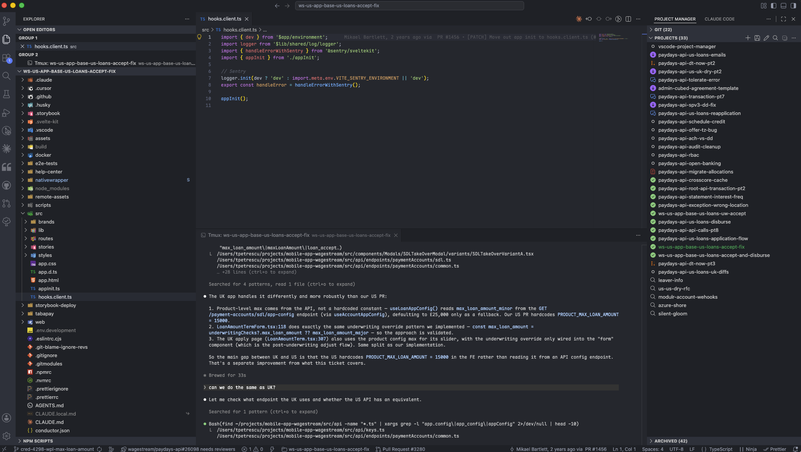

# Project Manager Fork — VS Code extension for Claude Code workflows

This is a personal fork of the [VS Code Project Manager extension](https://github.com/alefragnani/vscode-project-manager) that integrates Claude Code, tmux, and GitHub status into the project switcher.

## Features

- PR/CI status icons that update every 6s (passing, failing, pending, conflicts, approved, merged)
- Claude thinking 🌀 / needs-input 🔔 live indicators per project
- Hover tooltip: PR title, author, Jira link, Slack link, diff stats, tmux session uptime, Claude state
- Project lifecycle: clone, fork + carry Claude session, archive, post PR to Slack (with auto-react on merge)
- Investigations — instant scratch sessions with auto-generated names, promotable to real git projects
- Open tmux sessions as floating windows for non-active projects

## Installation

1. Download [`claude-project-manager.vsix`](https://github.com/tpetrescu93/claude-project-manager/releases/latest/download/claude-project-manager.vsix) and install via Extensions panel → `···` → Install from VSIX
2. Required on PATH: `claude`, `tmux`, `gh`, `git`, `jq`, `rsync`, `bun`
3. Add to VS Code settings: `"projectManager.git.baseFolders": ["~/projects"]` (or your repos folder)
   - Also ensure `"terminal.integrated.enablePersistentSessions": true` (this is the VS Code default — don't disable it; it's required for tmux session tabs to survive workspace switches)
4. For Slack posting: save the two skill files to `~/.claude/skills/pr-slack/SKILL.md` and `~/.claude/skills/pr-slack-react/SKILL.md`
   - [pr-slack/SKILL.md](https://gist.github.com/tpetrescu93/cc13d215ca8bdd5eb8a2cbcec44c349d)
   - [pr-slack-react/SKILL.md](https://gist.github.com/tpetrescu93/26377871c40e4084b1eea5abf2730471)
   - [.tmux.conf](https://gist.github.com/tpetrescu93/d8331e0e646de474824b232ca4ae52cf) (recommended tmux config)

## Credits

Built on top of [alefragnani/vscode-project-manager](https://github.com/alefragnani/vscode-project-manager). Licensed under GPLv3.
